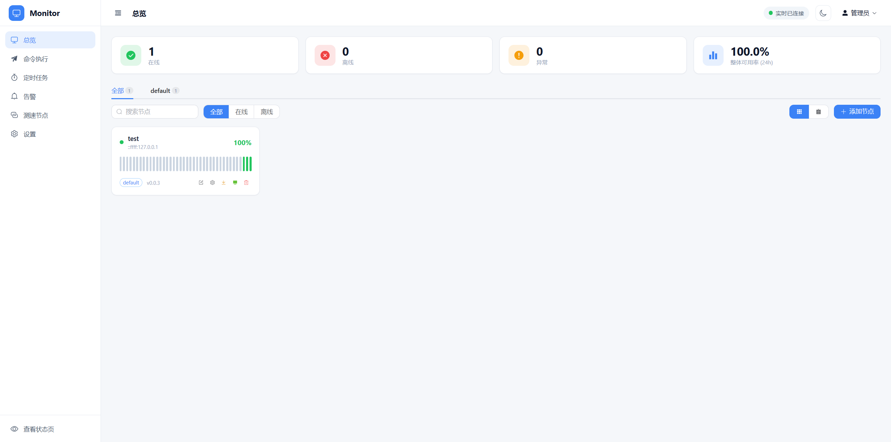
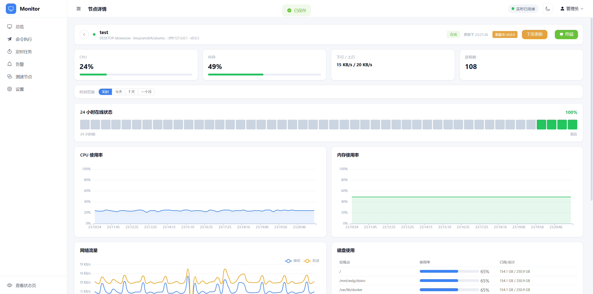
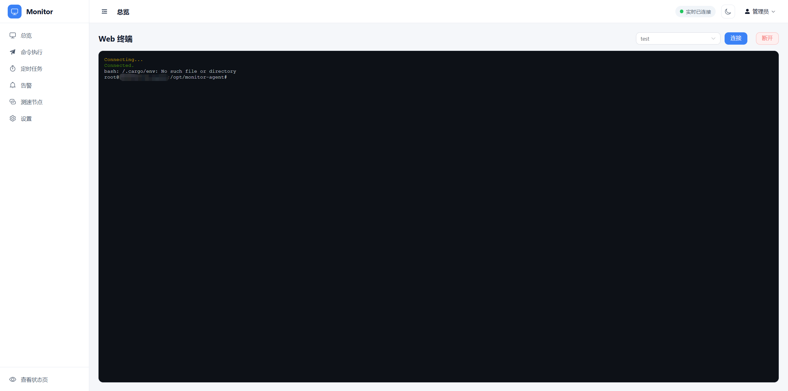

# 远程监控与运维控制系统

一套自托管的服务器监控与远程运维平台。通过部署在各节点上的轻量级 Go Agent 采集系统指标，经 WebSocket 实时上报到 Server，并在 Vue 管理后台统一查看监控数据、执行远程命令、打开 Web 终端、管理告警与定时任务。

## 截图





## 核心功能

- **实时监控** — Agent 采集 CPU / 内存 / 磁盘 / 网络指标，WebSocket 实时上报，节点详情页 ECharts 图表展示
- **节点管理** — 节点列表、在线状态、分组管理，以及网络节点（NetNodes）拓扑
- **远程命令** — 向节点下发命令并审计执行结果，支持命令白名单
- **Web 终端** — 基于 xterm.js + PTY 的浏览器终端，直连远程主机
- **文件管理** — 远程文件浏览与操作
- **告警系统** — 自定义告警规则引擎，支持 Email、Telegram、企业微信、Webhook 多渠道通知
- **定时任务** — 基于 node-cron 的任务调度管理
- **公开状态页** — 免登录的对外状态展示页面（`/api/public/status`）
- **Agent 自更新** — 安装脚本 + 自更新机制，支持 Linux / Windows / macOS

## 技术栈

| 组件 | 技术 |
|------|------|
| Server | Node.js 20+, TypeScript, Express 4, ws, Sequelize |
| Agent | Go 1.22+, gorilla/websocket, gopsutil, creack/pty |
| Dashboard | Vue 3, Vite, Element Plus, Pinia, ECharts, xterm.js |
| 认证 | JWT（管理员）, Token（Agent） |
| 通知 | Email, Telegram, 企业微信, Webhook |
| 定时任务 | node-cron |

## 项目结构

```
monitor-system/
├── packages/shared/      # TS 类型 + WebSocket 协议定义
├── server/               # Express + WS Gateway + Sequelize
│   └── src/
│       ├── controllers/  # 业务逻辑
│       ├── routers/      # 路由定义
│       ├── middleware/   # auth 中间件
│       ├── services/     # 核心服务
│       ├── ws/           # WebSocket gateway
│       └── db/           # Sequelize 模型
├── agent/                # Go Agent（单二进制）
│   ├── collectors/       # 指标采集
│   ├── connection/       # WS 客户端 + 重连
│   ├── executor/         # 命令执行 + 白名单
│   ├── terminal/         # PTY 会话
│   ├── file/             # 文件操作
│   └── scripts/          # install.sh / install.ps1 / update.sh
└── dashboard/            # Vue 3 + Element Plus 管理后台
    └── src/
        ├── views/        # 各功能页面
        ├── stores/       # Pinia stores
        └── api/          # HTTP + WS 封装
```

## 架构概览

```
┌─────────┐   WebSocket    ┌──────────┐   HTTP/WS    ┌─────────────┐
│  Agent  │ ─────────────► │  Server  │ ◄──────────► │  Dashboard  │
│  (Go)   │   指标/终端    │ (Node.js)│   API/实时   │   (Vue 3)   │
└─────────┘                └──────────┘              └─────────────┘
   节点端                     网关 + 存储                管理后台
```

- Agent 与 Server 之间通过 WebSocket 长连接通信，断线指数退避重连
- Server 作为网关统一管理节点在线状态、指标存储、命令分发与终端代理
- Dashboard 通过 HTTP API 与 WebSocket 与 Server 交互

## 快速开始

环境要求：Node.js >= 20、pnpm、Go >= 1.22

### 1. 安装依赖

```bash
pnpm install
```

### 2. 启动 Server

```bash
cd server
cp ../.env.example .env    # 配置数据库连接与密码
pnpm dev                   # tsx watch 热重载
```

### 3. 启动 Dashboard

```bash
cd dashboard
pnpm dev                   # Vite dev server，代理 /api 和 /ws 到 Server
```

### 4. 运行 Agent

```bash
cd agent
go mod tidy
go run .                   # 开发运行
```

## 构建

根目录提供了统一的构建脚本：

```bash
pnpm build                 # 构建 shared + server + dashboard
pnpm build:agent           # 编译 Windows Agent
pnpm build:agent:linux     # 编译 Linux Agent
pnpm build:agent:macos     # 编译 macOS Agent
pnpm build:agent:all       # 交叉编译全平台
```

## Agent 部署

Agent 编译为单二进制，提供安装脚本：

- **Linux** — `install.sh`，注册为 systemd 服务
- **Windows** — `install.ps1`，注册为 Windows 服务
- **自更新** — `update.sh` 支持在线更新二进制
